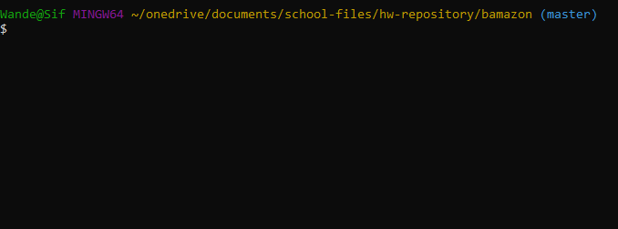
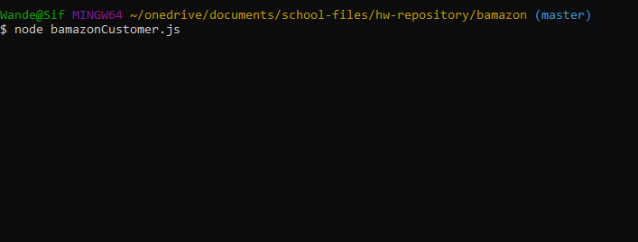
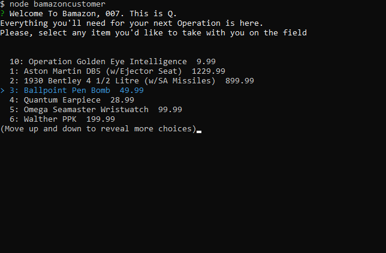
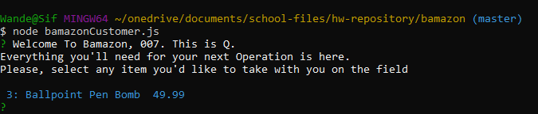
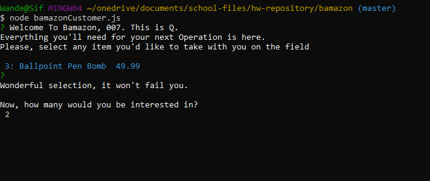
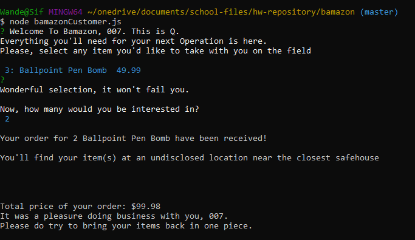
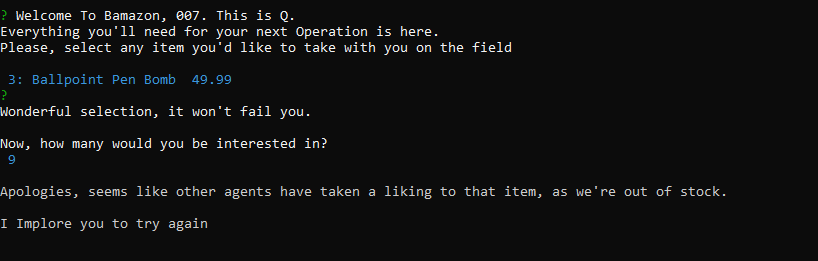

# Bamazon

### Hello, 007. This is Q, and welcome to our latest service to assist you in the field.

## Overview

* Bamazon is your all-in-one "storefront" for everything an agent will need on a mission-to-mission basis.
* Using the latest technology in Web Development, this ultra-secure application consists of Node.js, MySQL, and a dash of CMD/Terminal
* Feel free to call it "Bondmazon"

# Instructions

## Customer(Agent)-level

#### From start to finish, here is the process to place an order

### Step One

* Open up GIT BASH and/or terminal and **go** into the same directory where all the other "bamazon" files are located.

### Step Two

* In your "command line" application, type `node bamazonCustomer.js`

### Step Three

* After doing so, and a few seconds, the storefront will appear and prompt for you to select any item of your choosing (__see first image below__). Press **`Enter`** to confrim your selection (i.e., in this case, I chose the ever-reliable Ballpoint Pen Bomb).

### Step Four

* You'll now be prompted to enter the number of units of selected item you'd like to receive. As much as I would like for you to embellish your mission needs, please be considerate of our finite quantities. _This isn't a video game_ (i.e., in this case, I simply typed **`2`**, for 2 Ballpoint Pen Bombs)

## The proprietary Bamazon software will now "go and see" if the store has enough units for your order

### **IF THERE ARE/IS ENOUGH UNITS IN STOCK** 

### Step 5A

* A confirmation page will show up to verify your order, including: the number of units ordered, the item ordered, and the total amount to be paid.
* The application will automatically refresh, in case you'd like to purchase more items for your mission.

### **IF THERE WASN'T ENOUGH UNITS IN STOCK** 

### Step 5B

* An "error" page of sorts will show up, stating that the storefront does have contain the units enough to meet the amount ordered.
* While this does not happen often, there are times where this will.
* The applcation will automatically refresh, in case you'd like to try again, perchance with a lower quantity.

### Now go out there, and make MI6 proud, 007. 

#

